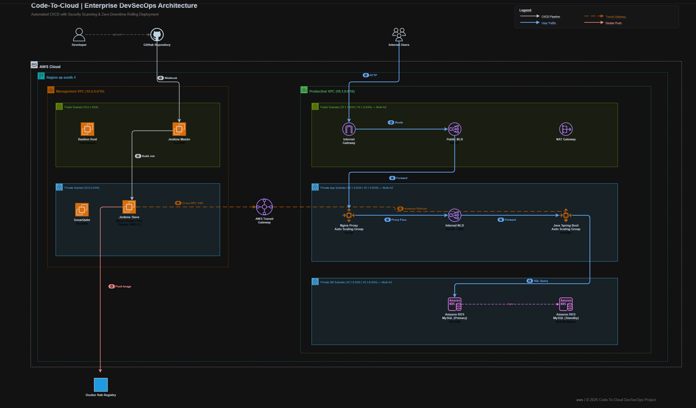

# Code-To-Cloud: Enterprise DevSecOps on AWS 3-Tier Architecture



## Table of Contents

1. [Project Overview](#project-overview)
2. [Architecture Overview](#architecture-overview)
3. [Pre-Requisites](#pre-requisites)
4. [Infrastructure Setup](#infrastructure-setup)
   - [VPC and Networking](#vpc-and-networking)
   - [Transit Gateway](#transit-gateway)
   - [Security Configuration](#security-configuration)
   - [Load Balancing](#load-balancing)
   - [Auto Scaling Groups](#auto-scaling-groups)
   - [Database Layer](#database-layer)
5. [CI/CD Pipeline Setup](#cicd-pipeline-setup)
   - [Jenkins Master/Slave](#jenkins-masterslave-configuration)
   - [GitHub Webhook](#github-webhook-integration)
   - [Pipeline Stages](#pipeline-stages)
6. [Application Stack](#application-stack)
   - [Spring Boot Application](#spring-boot-application)
   - [Multi-Stage Dockerfile](#multi-stage-dockerfile)
   - [Nginx Reverse Proxy](#nginx-reverse-proxy)
7. [Security Scanning](#security-scanning)
   - [Checkov (IaC)](#checkov-infrastructure-as-code-scan)
   - [SonarQube (SAST)](#sonarqube-static-analysis)
   - [Trivy (Container)](#trivy-container-vulnerability-scan)
8. [Deployment Strategy](#deployment-strategy)
9. [Troubleshooting Guide](#troubleshooting-guide)
10. [Technology Stack](#technology-stack)

---

# Project Overview

## Introduction

This project demonstrates the design and implementation of a **production-grade, fully automated DevSecOps pipeline** that deploys a Java Spring Boot web application onto a highly available AWS 3-tier architecture. The entire infrastructure is codified using **Terraform**, the CI/CD pipeline is orchestrated by **Jenkins**, and security is enforced at every stage through automated scanning tools.

The pipeline follows the "**Shift-Left Security**" philosophy — integrating security scans (infrastructure, application code, and container) early in the development lifecycle, long before any code reaches production.

### Key Features

- **Infrastructure as Code**: 100% of the AWS environment is provisioned and managed via Terraform across 7 reusable modules
- **High Availability**: Multi-AZ deployment with Auto Scaling Groups and Network Load Balancers
- **DevSecOps**: Three-layer automated security scanning (Checkov → SonarQube → Trivy)
- **Zero-Downtime Deployments**: AWS ASG Instance Refresh with rolling updates
- **Network Isolation**: Management and Production VPCs connected securely via AWS Transit Gateway
- **Containerized Workloads**: Multi-stage Docker builds with optimized, minimal runtime images

---

# Architecture Overview

## Infrastructure Components

### 1. Management Tier (CI/CD)
| Resource | Purpose | Network |
|---|---|---|
| Jenkins Master | Pipeline orchestration, GitHub Webhook receiver | Public Subnet (Mgmt VPC) |
| Jenkins Slave | Build execution, security scanning, Docker builds | Private Subnet (Mgmt VPC) |
| Bastion Host | Secure SSH gateway for administrative access | Public Subnet (Mgmt VPC) |
| SonarQube | Static Application Security Testing (SAST) server | Jenkins Slave (Port 9000) |

### 2. Presentation Tier (Frontend)
| Resource | Purpose | Network |
|---|---|---|
| Public NLB | Internet-facing load balancer (Port 80) | Public Subnets (Prod VPC) |
| Nginx ASG | Reverse proxy servers in Auto Scaling Group | Private App Subnets (Prod VPC) |
| NAT Gateway | Outbound internet for private instances | Public Subnets (Prod VPC) |

### 3. Application Tier (Backend)
| Resource | Purpose | Network |
|---|---|---|
| Internal NLB | Private load balancer routing to app servers | Private App Subnets (Prod VPC) |
| Java App ASG | Spring Boot application in Auto Scaling Group | Private App Subnets (Prod VPC) |

### 4. Data Tier
| Resource | Purpose | Network |
|---|---|---|
| Amazon RDS MySQL | Managed relational database (Port 3306) | Private DB Subnets (Prod VPC) |

### Network Architecture

| VPC | CIDR Block | Purpose |
|---|---|---|
| Management VPC | `10.0.0.0/16` | CI/CD tooling (Jenkins, Bastion) |
| Production VPC | `10.1.0.0/16` | Live application (Nginx, Java App, RDS) |

Cross-VPC connectivity is handled by an **AWS Transit Gateway**, allowing the Jenkins Slave to trigger deployments in the Production VPC without traversing the public internet.

---

# Pre-Requisites

## Required Accounts and Tools

### 1. AWS Account
- An AWS account with IAM user configured
- AWS CLI v2 installed and configured:
  ```bash
  aws configure
  # AWS Access Key ID: <your-key>
  # AWS Secret Access Key: <your-secret>
  # Default region: ap-south-1
  ```

### 2. Development Tools
```bash
# Terraform
terraform -v     # >= 1.5.0

# Docker
docker -v         # >= 20.x

# Git
git --version     # >= 2.x
```

### 3. Accounts
- **GitHub** — Source code repository + Webhook
- **Docker Hub** — Container image registry
- **SonarQube** — Code quality analysis (self-hosted on Jenkins Slave)

---

# Infrastructure Setup

All infrastructure is codified using Terraform and organized into 7 reusable modules:

```
infrastructure/
├── main.tf              # Root module — wires all modules together
├── variables.tf         # Global variables (region, CIDRs, environment)
├── providers.tf         # AWS provider configuration
└── modules/
    ├── vpc/             # VPCs, Subnets, IGW, NAT, Route Tables
    ├── tgw/             # Transit Gateway + VPC Attachments
    ├── security/        # All Security Groups (7 groups)
    ├── nlb/             # Public + Internal Network Load Balancers
    ├── asg/             # Launch Templates + Auto Scaling Groups
    ├── rds/             # RDS MySQL instance + Subnet Group
    └── jenkins/         # Jenkins Master + Slave EC2 instances
```

## VPC and Networking

```bash
# Initialize and deploy the entire infrastructure
cd infrastructure
terraform init
terraform plan
terraform apply -auto-approve
```

Two VPCs are created with the following subnet strategy:

| Subnet | CIDR | AZ | Purpose |
|---|---|---|---|
| Mgmt Public | `10.0.1.0/24` | ap-south-1a | Bastion, Jenkins Master |
| Mgmt Private | `10.0.2.0/24` | ap-south-1a | Jenkins Slave |
| Prod Public 1a | `10.1.1.0/24` | ap-south-1a | Public NLB, NAT GW |
| Prod Public 1b | `10.1.2.0/24` | ap-south-1b | Public NLB (Multi-AZ) |
| Prod App 1a | `10.1.3.0/24` | ap-south-1a | Nginx, Java App |
| Prod App 1b | `10.1.4.0/24` | ap-south-1b | Nginx, Java App (Multi-AZ) |
| Prod DB 1a | `10.1.5.0/24` | ap-south-1a | RDS MySQL |
| Prod DB 1b | `10.1.6.0/24` | ap-south-1b | RDS MySQL (Multi-AZ) |

## Transit Gateway

The AWS Transit Gateway acts as a centralized cloud router between both VPCs:
```hcl
resource "aws_ec2_transit_gateway" "main" {
  description = "Transit Gateway connecting Mgmt and Prod VPCs"
}
```
Route tables in both VPCs are updated so the Jenkins Slave can securely SSH into Production servers using private IP addresses.

## Security Configuration

Seven Security Groups enforce the principle of least privilege:

| Security Group | Inbound Rule | Source | Port |
|---|---|---|---|
| Bastion SG | SSH | Your IP only (`/32`) | 22 |
| Jenkins Master SG | HTTP | `0.0.0.0/0` | 8080 |
| Jenkins Slave SG | SSH | Jenkins Master SG | 22 |
| Public NLB SG | HTTP | `0.0.0.0/0` | 80 |
| Nginx SG | HTTP | `0.0.0.0/0` (NLB preserves client IP) | 80 |
| App SG | HTTP | Internal NLB SG | 8081 |
| DB SG | MySQL | App SG | 3306 |

> **Note**: The Internal NLB has `preserve_client_ip = false` to prevent asymmetric routing between servers in the same subnet.

## Load Balancing

Two Network Load Balancers handle traffic distribution:

```hcl
# Public NLB — Internet-facing, routes to Nginx
resource "aws_lb" "public" {
  name               = "prod-public-nlb"
  internal           = false
  load_balancer_type = "network"
  subnets            = var.public_subnets
}

# Internal NLB — Private, routes to Java App
resource "aws_lb" "internal" {
  name               = "prod-internal-nlb"
  internal           = true
  load_balancer_type = "network"
  subnets            = var.private_app_subnets
}
```

## Auto Scaling Groups

Both Nginx and the Java App use Launch Templates with `user_data` scripts:

```bash
# The Nginx user_data dynamically injects the Internal NLB DNS
cat << 'EOCONF' > /home/ubuntu/default.conf
server {
    listen 80;
    location / {
        proxy_pass http://${internal_nlb_dns}:80;
        proxy_set_header Host $host;
        proxy_set_header X-Real-IP $remote_addr;
    }
}
EOCONF
docker run -d -p 80:80 -v /home/ubuntu/default.conf:/etc/nginx/conf.d/default.conf:ro nginx:latest
```

## Database Layer

```hcl
resource "aws_db_instance" "mysql_master" {
  identifier           = "prod-mysql"
  engine               = "mysql"
  engine_version       = "8.0"
  instance_class       = "db.t3.micro"
  allocated_storage    = 20
  db_name              = "tasktracker"
  username             = "admin"
  password             = var.db_password
  skip_final_snapshot  = true
  vpc_security_group_ids = [var.db_sg_id]
  db_subnet_group_name   = aws_db_subnet_group.db_subnets.name
}
```

---

# CI/CD Pipeline Setup

## Jenkins Master/Slave Configuration

| Node | Instance Type | Installed Tools |
|---|---|---|
| Jenkins Master | `t2.medium` | Jenkins LTS, Git |
| Jenkins Slave | `t2.medium` | Java 17, Maven, Docker, SonarQube, Trivy, Checkov, AWS CLI |

The Master delegates all build jobs to the Slave via SSH. The Slave's label is `slave` and is referenced in the Jenkinsfile:
```groovy
pipeline {
    agent { label 'slave' }
}
```

## GitHub Webhook Integration

1. Navigate to your GitHub repository → **Settings** → **Webhooks** → **Add Webhook**
2. Configure the webhook:
   ```
   Payload URL:  http://<jenkins-master-ip>:8080/github-webhook/
   Content type: application/json
   Events:       Just the push event
   ```
3. In Jenkins, enable **GitHub hook trigger for GITScm polling** in the job configuration

## Pipeline Stages

The `Jenkinsfile` defines 7 automated stages:

```
┌──────────┐   ┌──────────┐   ┌──────────┐   ┌──────────┐   ┌──────────┐   ┌──────────┐   ┌──────────┐
│ Checkout │──▶│ Checkov  │──▶│ SonarQube│──▶│  Docker  │──▶│  Trivy   │──▶│  Push to │──▶│  Deploy  │
│   Code   │   │IaC Scan  │   │  SAST    │   │  Build   │   │  Scan    │   │Docker Hub│   │  to AWS  │
└──────────┘   └──────────┘   └──────────┘   └──────────┘   └──────────┘   └──────────┘   └──────────┘
```

---

# Application Stack

## Spring Boot Application

The application is a **Cloud Task Tracker** — a full-stack Spring Boot web application with:
- Spring Boot 2.7 with embedded Tomcat
- MySQL database connectivity via Spring Data JPA
- Thymeleaf server-side rendering
- Responsive frontend with task management (Create, Read, Update, Delete)

## Multi-Stage Dockerfile

```dockerfile
# Stage 1: Build the application
FROM maven:3.9.5-eclipse-temurin-11 AS builder
WORKDIR /app
COPY pom.xml .
RUN mvn dependency:go-offline -B
COPY src ./src
RUN mvn clean package -DskipTests

# Stage 2: Run the application
FROM eclipse-temurin:11-jre
WORKDIR /app
COPY --from=builder /app/target/tasktracker-0.0.1-SNAPSHOT.jar app.jar
EXPOSE 8081
ENTRYPOINT ["java", "-jar", "app.jar"]
```

**Why multi-stage?**
- Stage 1 image (~800MB) contains Maven, JDK, and all build tools
- Stage 2 image (~200MB) contains only the JRE and the compiled JAR
- Final image is **75% smaller** with a dramatically reduced attack surface

## Nginx Reverse Proxy

Nginx runs as a Docker container on the frontend Auto Scaling Group. It receives all incoming HTTP traffic from the Public NLB and forwards it to the Internal NLB, which routes to the Java application servers.

---

# Security Scanning

## Checkov (Infrastructure as Code Scan)
```bash
docker run --rm -v $(pwd):/tf bridgecrew/checkov -d /tf/infrastructure
```
Scans all `.tf` files for security misconfigurations (open security groups, unencrypted resources, etc.)

## SonarQube (Static Analysis)
```bash
mvn clean verify sonar:sonar \
  -Dsonar.projectKey=task-tracker \
  -Dsonar.host.url=http://localhost:9000 \
  -Dsonar.login=${SONAR_TOKEN}
```
Analyzes Java source code for bugs, code smells, vulnerabilities, and technical debt.

## Trivy (Container Vulnerability Scan)
```bash
docker run --rm -v /var/run/docker.sock:/var/run/docker.sock \
  aquasec/trivy image --severity HIGH,CRITICAL shyammedh/java-app:latest
```
Scans the Docker image for known CVEs in OS packages and application dependencies.

---

# Deployment Strategy

## Zero-Downtime Rolling Update

Instead of running `terraform apply` from Jenkins, the pipeline uses AWS-native rolling deployments:

```bash
aws autoscaling start-instance-refresh \
  --auto-scaling-group-name devops-app-asg \
  --region ap-south-1
```

**How it works:**
1. AWS spins up new EC2 instances using the latest Launch Template
2. New instances pull the latest Docker image from Docker Hub
3. The NLB health checks confirm the new instances are healthy
4. AWS gracefully drains connections from old instances
5. Old instances are terminated — **zero user downtime**

---

# Troubleshooting Guide

## Common Issues and Solutions

### 1. NLB Target Health Check Failures
```bash
# Check target group health
aws elbv2 describe-target-health \
  --target-group-arn <target-group-arn>

# Verify security group rules
aws ec2 describe-security-groups --group-ids <sg-id>
```

### 2. Asymmetric Routing (504 Gateway Timeout)
If the Internal NLB preserves the client IP, response traffic bypasses the load balancer:
```hcl
# Fix: Disable client IP preservation on the internal target group
resource "aws_lb_target_group" "app" {
  preserve_client_ip = "false"
}
```

### 3. Docker Container Not Starting
```bash
# SSH into the instance via Bastion and check Docker
sudo docker ps -a
sudo docker logs <container-id>
```

### 4. Jenkins Pipeline Failures
```bash
# Check Jenkins Slave connectivity
ssh -i slave_key ubuntu@<slave-private-ip>

# Verify Docker Hub credentials in Jenkins
# Manage Jenkins → Credentials → docker-hub-credentials
```

---

# Technology Stack

| Category | Technology | Purpose |
|---|---|---|
| Cloud Provider | Amazon Web Services (AWS) | Infrastructure hosting |
| IaC | Terraform | Infrastructure provisioning |
| CI/CD | Jenkins (Master/Slave) | Pipeline orchestration |
| Source Control | GitHub + Webhooks | Version control + triggers |
| Containerization | Docker | Application packaging |
| Container Registry | Docker Hub | Image storage |
| IaC Security | Checkov | Terraform vulnerability scanning |
| SAST | SonarQube | Code quality analysis |
| Container Security | Trivy | CVE scanning |
| Application | Java 11, Spring Boot 2.7, Maven | Backend application |
| Web Server | Nginx | Reverse proxy |
| Database | MySQL 8.0 (AWS RDS) | Data persistence |
| Networking | Transit Gateway, NLB | Cross-VPC routing, Load balancing |

---

## 🛠️ Author

This project was built and deployed by **Shyam**.

---

> **Note**: This infrastructure is deployed in `ap-south-1` (Mumbai). Remember to run `terraform destroy` when you are finished to avoid AWS charges.
